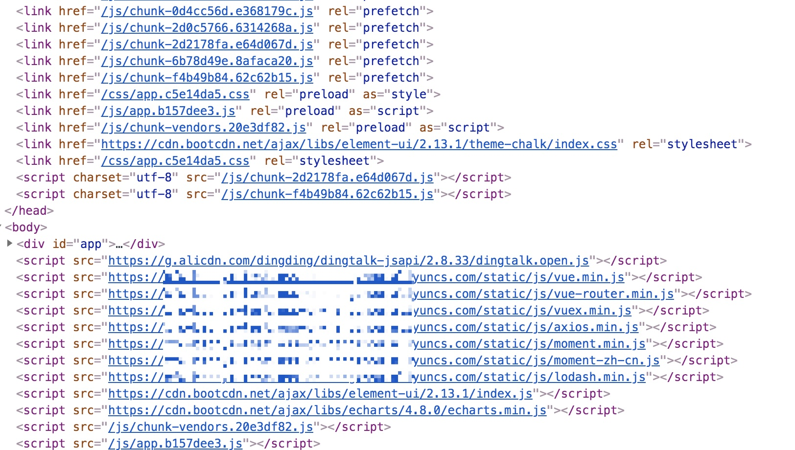

### 将静态资源通过CDN引入的形式（css固定CDN引入，js仅打包通过CDN引入（本地照常））

+ 安装依赖
```
 npm install import-assets-from-cdn -D
 yarn add import-assets-from-cdn -D
```

+ vue.config.js配置使用
```javascript
const importAssetsFromCdn = require('import-assets-from-cdn')

const cdn = { // 将会注入index.html js 顺序不可乱 注意版本
  css: [  // 固定CDN引入
    'https://xxx.cdn.com/static/css/element-ui.css',
  ],
  js: [   // 仅打包模式（process.env.NODE_ENV === 'production'）CDN引入，本地照常
    'https://xxx.cdn.com/static/js/vue.min.js',
    'https://xxx.cdn.com/static/js/vue-router.min.js',
    'https://xxx.cdn.com/static/js/vuex.min.js',
    'https://xxx.cdn.com/static/js/axios.min.js',
    'https://xxx.cdn.com/static/js/moment.min.js',
    'https://xxx.cdn.com/static/js/moment-zh-cn.js',
    'https://xxx.cdn.com/static/js/lodash.min.js',
    'https://xxx.cdn.com/static/js/element-ui.js',
    'https://xxx.cdn.com/static/js/echarts.min.js',
  ]
}

chainWebpack: config => {
  config
    .plugin('importAssetsFromCdn')
    .use(importAssetsFromCdn, [cdn])
}
```

或者 

```javascript
const importAssetsFromCdn = require('import-assets-from-cdn')

{
  // ... config settings here ...
  plugins: [
    new importAssetsFromCdn(cdn))
  ]
};
```


+ 使用效果



